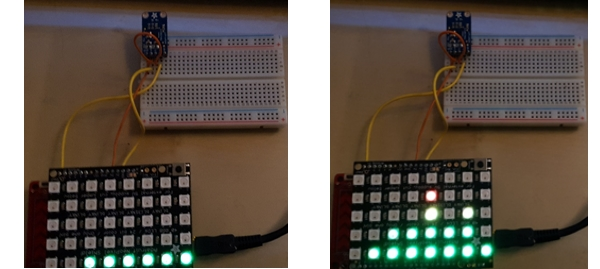

# Audio Spectrum Analyzer

In dit project maken we gebruik van de PSoC 4 om in real-time op een ledmatrix een audiospecrum analyse te visualiseren.

## Componenten
- De PSoC 4
- De Adafruit neopixel
- De Adafruit MAX9813 microphone amplifier (met ingebouwde Auto Gain Control)</li>

## Beschrijving

De output van de microfoon is verbonden met P(0,0). De gain is verbonden met de Vdd, wat de agc instelt op 40dB (deze staat standaard op 60dB). Door de PSoC forums te doorzoeken hebben we een basis gevonden betreft het sturen van een Adafruit neopixel en het omvormen van het analoge microfoon signaal naar een digitaal signaal.

## Verbeteringen

Nu werd een MAX9813 gebruikt maar PSoC beschikt over een amplifier.

## Referentielijst

- [CypressForum](https://community.cypress.com/thread/16543)
- [Hackster](https://www.hackster.io/MarkHastings/christmas-decorations-with-neo-pixel-rings-71baec)