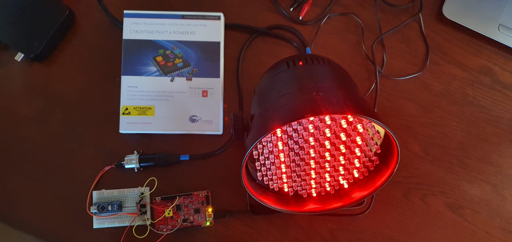

# DMX over SPI/ UART
*Geschreven door Rein van der Linden en Sam Knoors*

## Benodigdheden:
- PSOC 4
- SN75176
- XLR connector
- DMX apparaat
- psoc creater

## Beschrijving

Het doel van dit onderzoek is het begrijpen en het creëren van een DMX-signaal met de PSOC 4. Als dit verkregen is zal er een DMX RGB Led par worden aangesloten op de PSOC en zal de data verstaan moeten worden door die led par. De verschillende communicatieprotocollen die worden gebruikt zijn UART en SPI.

Het is de bedoeling de UART en SPI blokken zo te configureren dat er een bruikbaar DMX-signaal verkregen wordt. De uiteindelijke methode zal SPI zijn omdat tijdens het onderzoeken van de UART-methode onvoorziene complicaties aan het licht kwamen. Het uiteindelijke resultaat is dat de LED par luistert naar de data die gestuurd wordt en dat die de juiste kleur weer geeft. Alleen zit er een flikkering van andere kleuren doorheen. 

De oorzaak wordt verder beschreven in deze paper. Ook zullen de onderzoeksmethode, resultaten en adviezen besproken worden.