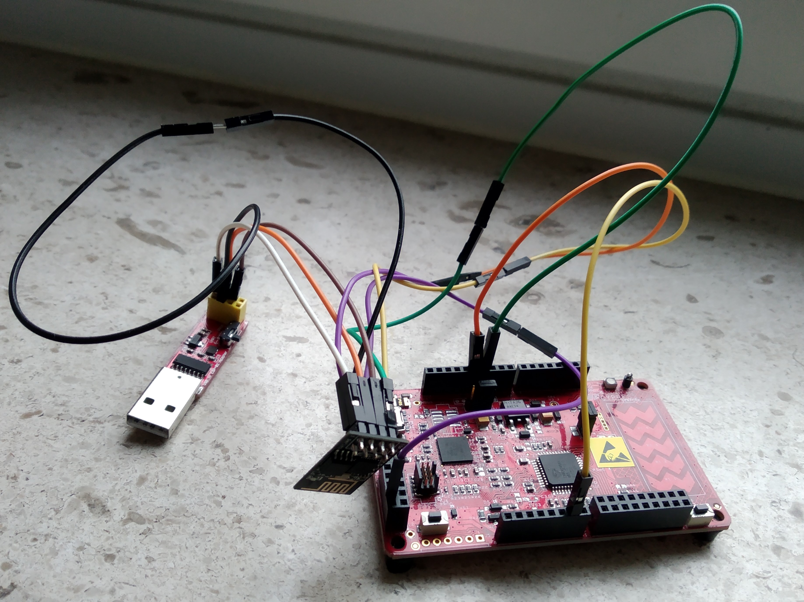

# OTA firware updating a PSoC4 with an ESP8266
*Written by Tom Mingneau, Bryan Honof and Guido Frissaer*

## Beschrijving

Deze paper bespreekt de mogelijkheden die er bestaan om de firmware van de PSoC 4
microcontroller te updateten via de ESP8266 over een Wi-Fi netwerk. Dit is een zeer nuttige applicatie aangezien men op deze manier een moeilijk bereikbare PSoC 4 in het werkveld vanop afstand kan voorzien van nieuwe software. Het materiaal dat hierbij gebruikt werd bestaat uit een PSoC 4, de ESP8266 en een CH340 TTL naar USB adapter.

Voor dit onderzoek werd het PSoC UART bootloader host programma herschreven zodat
dit zou functioneren op de ESP8266. Daarna werd er een hexadecimale code, die een
applicatie bevat, geupload naar de ESP8266 via een webserver en deze werd dan lijn per
lijn via UART geschreven naar het flash geheugen van de PSoC 4.

Deze methode bleek zeer uitdagend te zijn aangezien men de communication API van het
originele host programma moest herschrijven voor de ESP8266. Daarna moest het
volledige programma inclusief API’s gedebugged worden via een tweede UART om telkens
opnieuw te kijken waar het programma exact gestopt was.

## Benodigdheden:

- PSoC 4
- ESP8266
- CH340G TTL naar USB adapter
- Jumper kabels

## Resultaten

### Webserver op ESP01
Om een webserver te realiseren op de ESP01 wordt er gebruik gemaakt van een bestaande applicatie die hervormd wordt om ons doel te bereiken. Deze applicatie maakt eerst verbinding met een ingesteld WiFi-netwerk. Hierdoor krijgt de ESP ook zijn eigen IP-adres. Daarna wordt de webserver zelf opgestart, deze luistert naar HTTP requests op poort 8080. Wanneer er een HTTP get request naar http://”ipaddress”:8080 gestuurd wordt gaat er door een HTML script een pagina gecreëerd worden, hierop staat een invulveld voor de hexadecimale code en een knop om deze te uploaden. Via dit veld kan dan de hexadecimale code geupload worden naar de ESP01. Dit is getest en werkt.

### Bootloader host programma op ESP01
Om deze hexadecimale code te schrijven naar de PSoC wordt er dus gebruik gemaakt van het originele bootloader host programma van Cypress zelf. Er moet enkel gezorgd worden dat de geuploade hexadecimale code binnen het programma in de correcte array opgeslagen wordt. Daarna kan deze dan gebruikt kon worden als parameter binnen de BootloadStringImage functie die dient om de PSoC 4 te bootloaden via UART. Deze functie maakt gebruik van vier API’s gecreëerd door Cypress. Deze API’s moeten dan als libraries geïmporteerd worden in de Arduino IDE zodat deze gebruikt kunnen worden voor het programma. De communication API moet helemaal herschreven worden aangezien de functies die de PSoC 4 UART aanspreken niet voor de ESP01 werken. Deze moeten vervangen worden door de functies uit de HardwareSerial library van Arduino.

Bij het testen bleek dat het bootloaden niet meteen succesvol gebeurde. Hierdoor moest er een manier gevonden worden om de API’s volledig te kunnen debuggen. Gelukkig had de ESP01 twee GPIO pinnen waarvan GPIO2 gebruikt kan worden als Tx lijn om te debuggen.

Door de debugging berichten te volgen kon ik uiteindelijk een paar problemen oplossen door de code lichtjes aan te passen. Jammer genoeg vond ik geen oplossing voor de stop die gebeurt net nadat de eerste bytes ingelezen worden. Het volgende wordt verstuurd naar de PSoC4 en daarna ontvangen door de ESP01 :

De volgende code wordt geschreven naar de PSoC : **1 32 1 00 CC FF 17**

value | description
----- | -----------
1 | startbyte
32 | command code -> get flash size
1 0 | data lengte
0xCC 0xFF | checksum bytes
0x17 | stopbytes

Daarna wordt volgende code ontvangen door de ESP01 :**1 4 0 0 FB FF 17**

value | description
----- | -----------
1  	|  startbyte
4  	|  error code -> the data is not in the proper form
0 0	|  data length
FB FF |  checksum bytes
17  |  stopbytes

De 4 geeft dus een error weer waaruit we kunnen concluderen dat de doorgestuurde data niet in het correcte formaat staat. Dus heb ik nog een aantal zaken geprobeerd om dit op te lossen waaronder : de HEX code uit de AN omgezet naar little endian, de read functie op een andere manier geschreven, de J9 header op 5V gezet en gebruik gemaakt van een spanningsdeler om de logische niveaus gelijk te houden. Jammer genoeg bleef de foutcode hierboven in al deze gevallen hetzelfde.

### Resultaat

Uiteindelijk is het gewenste resultaat niet bereikt, maar er is wel vooruitgang geboekt. Door de API’s te debuggen heb ik exact kunnen terugvinden waar het programma stopt zodat er onmiddellijk kan verder gewerkt worden van waar ik heb moeten stoppen. De verwachtingen voor dit onderzoek zijn jammer genoeg niet volledig ingelost. Dit is vooral te wijten aan een gebrek aan nuttige informatie. In de application note van Cypress staan wel schema’s, diagrammen en foutcodes, maar geen richtlijnen over hoe het verder moet na het krijgen van bepaalde foutcodes. Daarnaast is er veel tijd gekropen in het herschrijven van de communication api en het debuggen van het bootloader host programma.

### Toekomst

Voor toekomstig onderzoek zou ik rekening houden met de volgende zaken :
- De ESP8266 werkt op 3,3V en kan tot 350 mA verbruiken bij het opstarten. Dit is zeer belangrijk aangezien vele microcontrollers niet de benodigde stroomsterkte kunnen leveren om de ESP volledig van stroom te voorzien.
- Om de ESP in de correcte mode te krijgen moeten bepaalde pinnen laag of hoog getrokken worden. Hier heb ik in het begin van het onderzoek problemen mee gehad waardoor ik de CH340 adapter heb gekocht.
- De tweede TX pin is zeer handig om als seriële debugger te gebruiken aangezien de ESP01 hiervoor geen andere opties biedt.
- De informatie die Cypress aanbiedt omtrent het bootloaden van de PSoC 4 via een andere microcontroller is vrij abstract, hierdoor is het moeilijk uit te zoeken wat er precies misloopt.