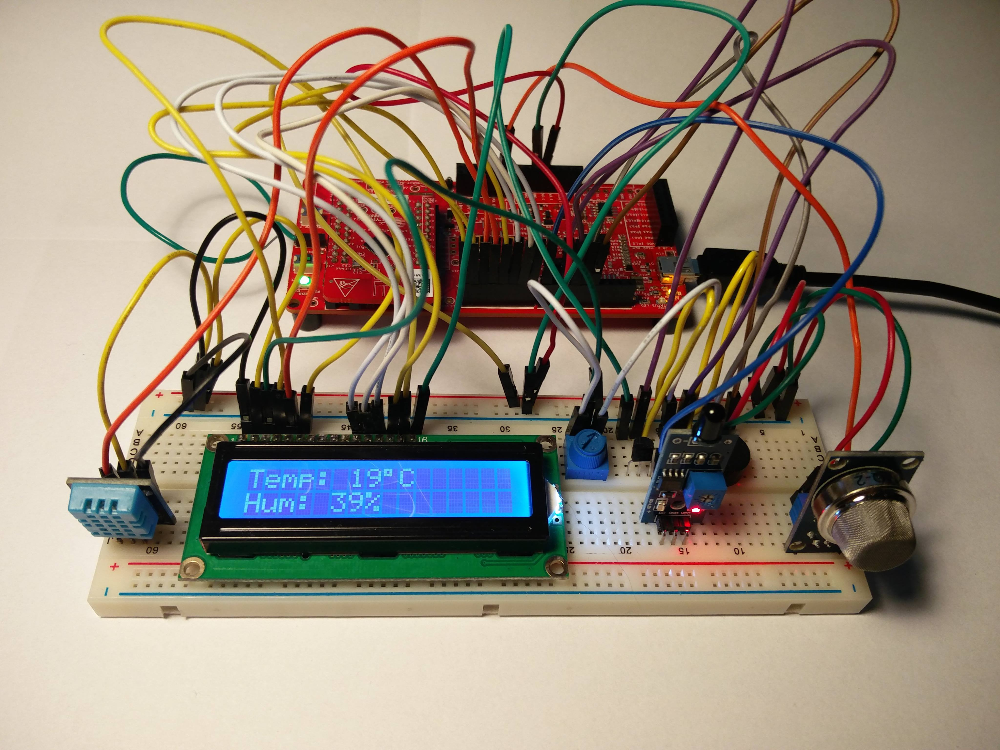
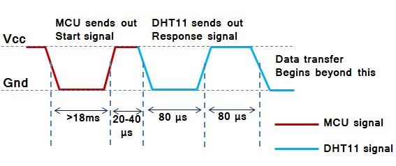

# IoT sensors for indoor
*Written by Jordy Achten And Jeffrey Gorissen*

Dit project heeft als doel de lucht binnenshuis te monitoren.



## Benodigdheden

- PSoC 4 (CY8CKIT-042)
- DHT11 temperature and humidity sensor
- MQ-2 gas sensor
- Flame sensor
- LCD
- Breadboard
- Jumpercables
- Lighter (for test purposes)

## Beschrijving

De PSoC leest periodiek de temperatuur-, vochtigheids-, proximity-, gas- en vuursensor uit. Verder wordt er een LCD aangestuurd. Het LCD staat standaard uit omdat deze verbonden is met 2 transistoren die als schakelaar werken. Zodra de proximity meter opmerkt dat men dichtbij komt (bijvoorbeeld met uw hand), gaat er een spanning komen op de basis van de transistoren en zal de LCD aanspringen en iets op het scherm tonen.

Wat op het scherm komt is afhankelijk van de gemeten waarden van de sensoren. Indien er niets abnormaals gemeten wordt, zal de LCD afwisselend de temperatuur, vochtigheid, gas en proximity waardes tonen.

Als er hoge CO2 of gas waardes gemeten of als er vuur opgemerkt wordt, zal er een waarschuwing op het scherm te lezen zijn. Ook zal de buzzer afgaan en een bieptoon 
laten horen om alarm te slaan.

Tot slot is er een status led die als er niks abnormaals 
gemeten wordt groen is. Indien er echter een hoge CO2 waarde gemeten wordt is de led geel. In het geval van gas of vuur detectie zal de led rood worden.

### DHT11

De temperatuur en vochtigheid sensoren zitten gebundeld in 1 package, de DHT11. Het opmerkelijke wat hier bij te melden valt is dat deze sensor niet gewoon uit te lezen valt zoals men zou verwachten. De DHT11 maakt namelijk gebruik van een ‘Single Wire Interface’. Dit is een protocol dat vaak gebruikt wordt in kleine, relatief goedkope toestellen zoals een weerstation of in dit geval een binnenshuis monitor. Het protocol (Figuur 6) is gelijkaardig aan I2C maar gebruikt slechts één draad, daarom one wire genoemd. Verder is het specifiek ontwikkeld voor lage baud- en bandbreedtes.
De communicatie via het 1-draads protocol is gebaseerd op het lezen van de duur van laag signaal en de duur van het hoge signaal. Typisch gezien krijgt men een signaal van de sensor. Bij de DHT11 is het zo dat men de PSoC een signaal moet laten sturen. Als het ware een ‘hallo welke waardes heb je?’ request. Dit signaal is een pull down van ongeveer 18 ms. Vervolgens gaat de DHT11 werken om de temperatuur en vochtigheid te kunnen returnen, de ‘oh laat me even kijken, deze waardes heb ik’ response. Dit wordt door de DHT11 in een 40-bit response signaal terug naar de PSoC gestuurd.
Het voordeel van deze werking is stroomverbruik. Het is namelijk zo dat de gebruiker kan kiezen wanneer er data ingelezen moet worden. Zodra de data doorgestuurd is naar de PSoC gaat de DHT11 in low power mode tot deze een start signaal van de MCU krijgt.
Voor de DHT11 kan kan men best gebruik maken van een DHT inlees functie ( DHT_read() ) die men elke keer kan gebruiken wanneer men de waardes nodig heeft.



```c
int DHT_read()
{
    uint8 IState;
    IState = CyEnterCriticalSection();
    uint8 bits[5];
        uint8 cnt = 7;
        uint8 idx = 0;
    int calc = 0;
    int timeout = 0;
    for (int i = 0; i < 5; i++ )
        bits[i] = 0;    
    DHT11_Write(0u);
    CyDelay(19);
    DHT11_Write(1u);
    while (DHT11_Read() == 1)
    {
        timeout++;
        if (timeout > 500)
            goto r99;                   //DHT error function
    }
    while(DHT11_Read() == 0) 
    {         
        timeout++; 
        if(timeout > 500)
            goto r99;                   //DHT error function
    } 
    calc = timeout; 
    timeout = 0; 
    while(DHT11_Read() == 1); 
    for (int i = 0; i < 40; i++) 
    { 
        timeout = 0; 
        while(DHT11_Read() == 0); 
        while(DHT11_Read() == 1) 
            timeout++;
        //Data acquiring point
        if ((timeout) > (calc / 2))
            bits[idx] |= (1 << cnt);
        if (cnt == 0)                   //next byte?
        {
   		    cnt = 7;                    // restart at MSB
   		    idx++;                      //next byte!
   	    } 
        else
        {
            cnt--;
        }
   } 
   humidity = bits[0];  
   temperature = bits[2];  
   CyExitCriticalSection(IState); 
   CyDelay(1); 
   return 0; 
   r99:                                 //Goto label for error in DHT reading
       humidity    = 0;  
       temperature = 0;  
       CyExitCriticalSection(IState); 
       return 99; 
}
```

### MQ-2
De Gas sensor is een veelzijdige sensor die veelvuldig gebruikt wordt om gaslekken te detecteren. Ze zijn zeer geschikt om brandbare gassen zoals LPG, butaan, propaan, methaan ,alcohol en waterstof te detecteren. Verder is deze sensor ook geschikt om rook te op te merken door middel van CO en CO2 detectie. 
In tegenstelling tot de DHT11 sensor is dit een gewone analoge sensor. Het voordeel hierbij is dat de code een stuk eenvoudiger is zoals men kan zien in Figuur 8. Het nadeel is dat de sensor continue stroom verbruikt en niet op zich zelf in een low power mode zal gaan staan.

```c
if (ADC_IsEndConversion(ADC_RETURN_STATUS))
{
	gasValue = ADC_GetResult16(0);
}
```

## Toekomst

Als uitbreiding hadden we graag nog bluetooth toegevoegd aan het verhaal om zo ook vanuit de zetel de waardes te kunnen bekijken met behulp van de smartphone. Dit is echter niet haalbaar gebleken voor ons binnen de duur van het project.