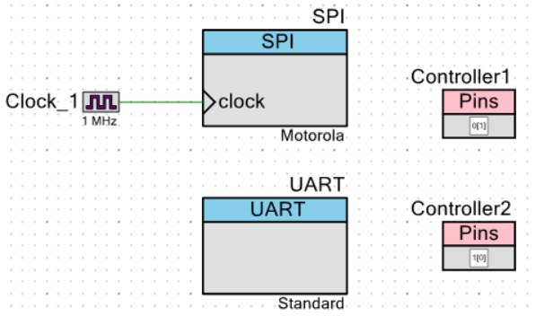
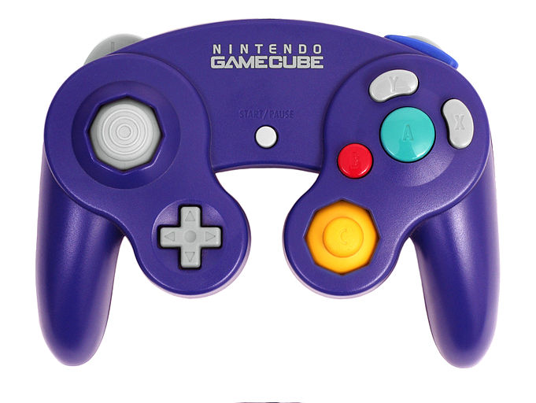
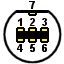
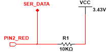
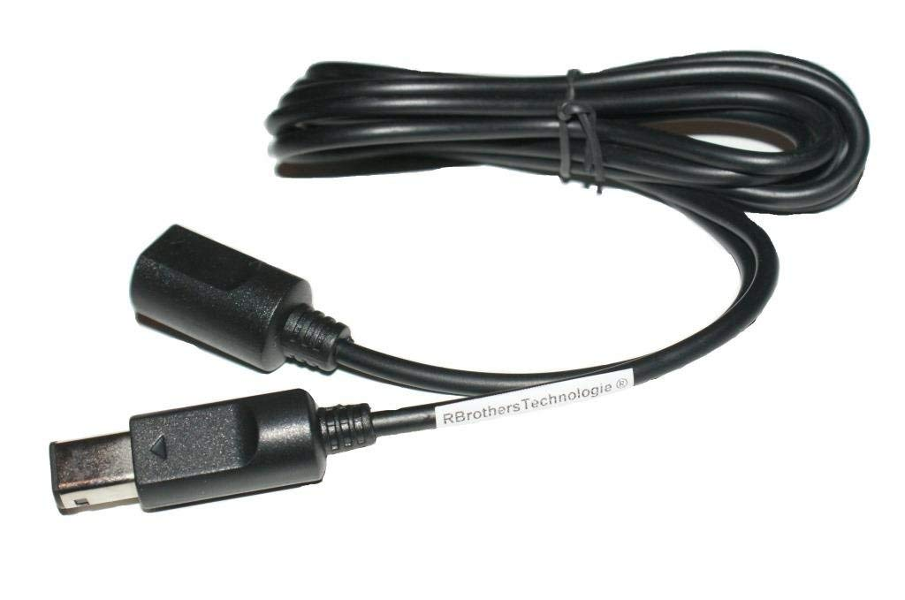
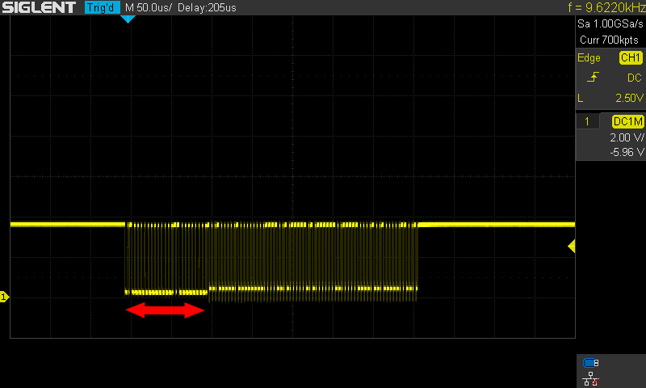
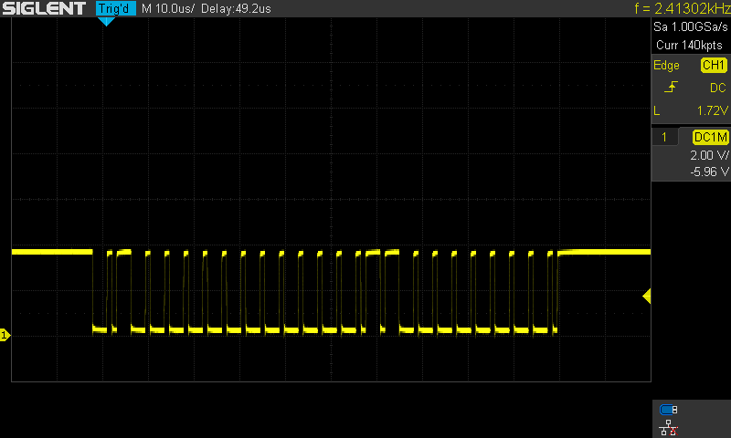

# Pong game

## Hardware

The board exists of **80** [Olimex RGB matrixes](https://www.olimex.com/Products/Modules/LED/MOD-LED8x8RGB/open-source-hardware), but in this project we only use **50** of them (daisy chained). Two controllers are used to control the players pong board and resetting the game.

The 'CY8CKIT-042 PSoC® 4 Pioneer Kit' is used to read in the controller protocols through a costum written program. The data transfer to the board is controlled by one SPI bus on the PSOC4.

## Software

The code is written in C and split up in different game functions, the most important ones are the ReadController, ControllerHandlers, DrawPixel, DrawLine, , Display, ClearBORD and ClearALL.

## Gamecube Controller

Om het spel Pong te kunnen spelen moest er een manier bedacht worden om op zijn minst twee knoppen per speler te kunnen verbinden met de PSOC. Dit is ook de manier waarop de eerste versies van het spel bediend werden: vier drukknoppen verbonden via het µc lab (zie afbeelding hieronder).

Maar een betere oplossing voor het probleem was het gebruik van een echte controller, en we hebben in dit geval gekozen voor een GameCube controller (zie foto).

Het voordeel van deze controller is het aantal en type van user inputs. Er zijn in totaal 12 digitale knoppen, 2 joystics en 2 analoge triggers.
	

	
## Elektrisch Schema

De verbindingen om een gamecube controller aan te sluiten zijn redelijk eenvoudig. Er zijn twee voedingen nodig: een voeding van 5V (voor de rumble motor) en een van 3.43V (of 3.3V). De bidirectionele datalijn moet met een pull-up weerstand verbonden worden met 3.3V (figuur rechts). De pinout van de connector en de kleurcode van de draden zijn terug te vinden in de linkse figuur en de tabel hieronder. [GameCube controller protocol](http://www.int03.co.uk/crema/hardware/gamecube/gc-control.html).

Let wel op dat deze spanningswaardes altijd nagemeten moeten worden bij namaak controllers en accessoires, want de kleuren kunnen afwijken. 
	

PIN | KLEUR | FUNCTIE
--- | ----- | -------
1 | Geel | 5V voeding (gebruikt door rumble motor)
2 | Rood | DATA-lijn: pullup met 3,43V
3 | Groen | Ground
4 | Wit | Ground
5 | / | NC
6 | Blauw | 3,43V (3,3V werkt ook)
7 | Zwart | Ground

Voor dit project is gebruik gemaakt van een verlengsnoer voor de controller zodat er niet moet worden geknipt in de verbindingskabel van de originele controller.
	

## Gamecube Controller Protocol
	
De GameCube controller gebruikt een propriëtair asynchroon protocol om te communiceren met de console. Het protocol heeft wel veel overeenkomsten met het One-Wire protocol, aangezien het data over een bidirectionele lijn stuurt.
Het protocol werkt als volgend: een hoge bit is gedefinieerd als een 1µs laag en een 3µs hoog signaal. Een lage bit net andersom: 3µs laag en 1µs hoog. De controller ontvangt een 24 bit sequentie van de console (of in dit geval de psoc 4) en reageert daarop met een 8 byte sequentie met de status van de knoppen en joysticks.
De sequentie die gestuurd wordt door de console/psoc is 0x800601. Om de controller te laten trillen moet er twee bits veranderd worden. De sequentie wordt dan 0x800602.
Zoals reeds gezegd stuurt de controller hierna 8 bytes met data terug. De data die teruggestuurd wordt en de corresponderende controls worden hieronder weergeven
	
BYTES | BIT 1 | BIT 2 | BIT 3 | BIT 4 | BIT 5 | BIT 6 | BIT 7
----- | ----- | ----- | ----- | ----- | ----- | ----- | -----
BYTE 0 | 0 | 0 | 0 | START | Y | X | B | A
BYTE 1 | 1 | L | R | Z | D-Up | D-Down | D-Right | D-Left
BYTE 2 |  |  |  | Joystick X Waarde
BYTE 3 |  |  |  |  Joystick Y Waarde
BYTE 4 |  |  |  |  C-Stick X Waade
BYTE 5 |  |  |  |  C-Stick Y Waarde
BYTE 6 |  |  |  |  Linkse Knop Waarde
BYTE 7 |  |  |  |  Rechtse Knop Waarde
	
## Bit-Banging Psoc4

Een eerste oplossing om de controller te kunnen uitlezen was het gebruik van een 1-Wire library wegens de overeenkomsten van beide protocollen. Maar het bleek dat er geen library beschikbaar was voor de psoc die een minimale waarde van 1µs kon bereiken.
Daarom werden de pinnen manueel hoog en laag gezet door de cpu (bit-banging). De synchronisatie gebeurd door het gebruik van de functie CyDelayCycles. Op afbeelding is de startsequentie te zien die door de psoc 4 wordt uitgestuurd. De respons van de controller is te zien op de afbeelding met de rode pijl. Deze geeft de startsequentie weer.

