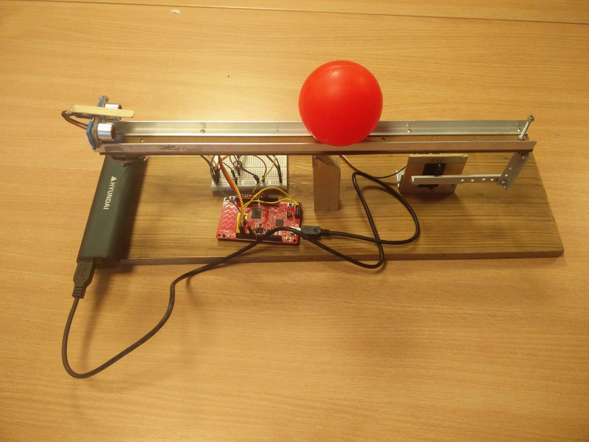

# PID ball-balance			*Written by Michiel Devue & Bram Willems*

## Beschrijving
Voor ons microcontroller project hebben we gekozen voor een PID ball-balance. Dit is een bal die met behulp van een servomotor wordt gebalanceerd op een staaf. De positie van de bal wordt gemeten met een ultrasone sensor en de regeling van de servo gebeurt via een PID-regeling. Om dit project uit te breiden hebben via hardware blokken de slaapstand van de CPU gebruikt. Telkens wanneer de ultrasone sensor een signaal uitstuurt en hierna wacht op een terugkomend signaal, zal de CPU in slaapstand gaan. De setpoint wordt geregeld met een potmeter.

Het PID-gedeelte van dit project gaat redelijk goed. Als de meting goed verloopt komt de bal in balans. Ook met de UART kunnen we allerlei data bekijken om na te gaan of de bal echt juist ligt of als er ergens een fout is. Het grootste probleem is echter dat de positie van een bal meten met een ultrasone sensor met problemen komt. Als de bal verder dan ongeveer 25 cm rolt worden de signalen van de sensor zodanig verspreid dat er foute metingen voorkomen. Dit hebben we deels kunnen oplossen door het programma de foute metingen te doen negeren. We hebben een stroommeting gedaan om de winst in energie te meten als men de CPU al dan niet in slaap zou doen. Uit deze meting blijkt dat de CPU in slaap doen voordelig is om stroom te besparen. Dit doen we als de bal 50 metingen na elkaar op de juiste positie ligt. De CPU wordt dan af en toe wakker om nog eens te controleren.

Dankzij dit project hebben we onze ervaring met microcontrollers kunnen tonen. Ook al heeft de meting van de ultrasone sensor enkele problemen, hebben een werkend programma gemaakt dat gebruik maakt van interrupts, een PID-schakeling en de slaapstand van PsoC 4.

## Benodigdheden
- psoc 4 pioneer kit
- Servo motor
- ultrasoon sensor
- Breadboard
- Jumper kabels
- Potentiometer

## Methode

De setpoint is het punt waar de bal zal moeten komen liggen en wordt ingelezen met
een potentiometer via een ADC. De positie van de bal wordt ingelezen met behulp
van een ultrasone sensor. Op de gegevens die binnenkomen worden bewerkingen
uitgevoerd om een correcte PWM-output voor de servo motor te bekomen. Hierna
wordt deze PWM op de servo gezet en zo kan het oppervlak hellen om de bal te doen
rollen. Dit algoritme gebruikt de positie van de bal ten opzichte de setpoint en de
snelheid van de bal in een bepaalde richting. Ook wordt de permanente fout
weggewerkt met de I-actie. Zo zal de servo de bal in balans brengen.

Op de UART worden volgende waardes getoond: een aanduiding van foute metingen,
de meting omgezet in centimeters, de positie waar het programma denkt waar de bal
ligt, de setpoint, het derivaat en de integraal.

## Resultaten

Het stabiliseren van de bal gaat redelijk goed als de setpoint tussen 15 cm en 25 cm
ligt. Buiten deze waardes geeft de ultrasone sensor te veel foute metingen. Foute
metingen worden genegeerd zoals besproken in het volgende hoofdstuk, maar als er
niet genoeg juiste metingen binnenkomen zal het systeem alsnog uit balans geraken.
We zien wel dat als de metingen kloppen, de PID-regeling tot een gebalanceerd punt
geraakt en daar niet meer van zal afwijken.

Om de energie-efficiëntie te onderzoeken bij het in slaap laten gaan van de CPU
hebben we een stroommeting gedaan om te kijken hoeveel stroom te PsoC4 trekt.
Eerst hebben we gemeten zonder de CPU in slaap te laten gaan. Hierbij was de
gemiddelde stroom 8,5mA, wanneer we echter de CPU in slaap laten gaan als de bal
op de juiste locatie ligt meten we een gemiddelde stroom van 6,5mA. Het is dus
zeker de moeite waard om de CPU in slaap te laten gaan waar het mogelijk is.

## Discussie

Bij het uitwerken van dit project kwamen we enkele onverwachte problemen tegen.
Het grootste probleem is dat de positie meten van een bolvormig object met een
ultrasone sensor niet ideaal is. Omdat een bal de uitgestuurde signalen in allerlei
richtingen verspreid zijn er enkele foute metingen. Om dit op te lossen worden
metingen die te hard verschillen met de rest genegeerd. In dit geval gaat er een teller
omhoog die aangeeft hoeveel foute metingen er na elkaar gebeurt zijn. Als deze
teller 10 bereikt betekent dat het programma geen idee heeft waar de bal ligt en
wordt de meting ook geaccepteerd.

Op de UART worden hierdoor twee locaties aangetoond. De meting en de plaats
waar het programma denkt dat de bal ligt.
Een ander probleem is dat de ADC meting van de potentiometer niet stabiel genoeg
is. Een waarde die maar 1 cm varieert is genoeg voor dit systeem uit balans te
brengen. Dit is opgelost door de waarde van de potentiometer in stappen van 2 cm
te laten veranderen.

We moesten ook beslissen wanneer we de CPU in slaap wouden laten gaan. We
hebben besloten om na 50 metingen waarbij de bal op de juiste locatie ligt in slaap te
gaan. Hierdoor moet de CPU niet elke keer opstarten als de bal voorbij de juiste
locatie rolt maar gaat hij enkel in slaap als de bal goed ligt. Het is empirisch getest dat dit de meest efficiënte wachttijd is. Nadat de CPU in slaap is zal deze na een bepaalde tijd terug wakker worden voor een meting uit de voeren om te controleren of de bal nog juist ligt.