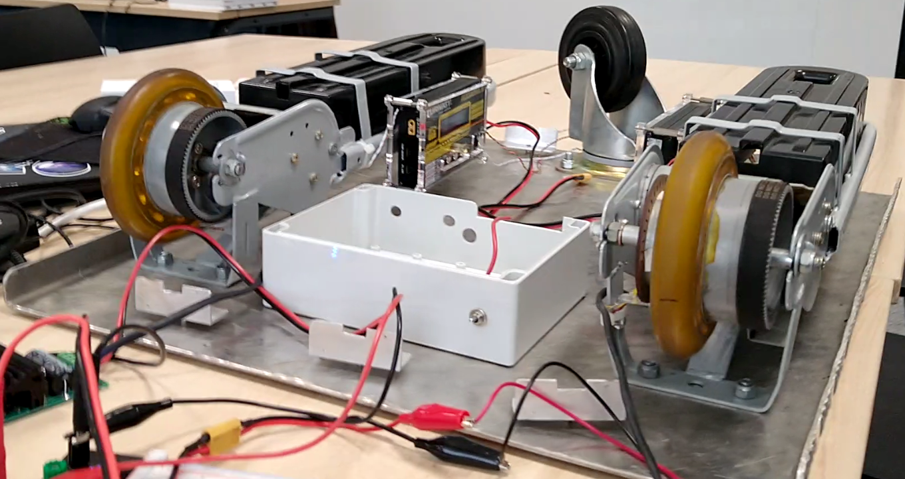

# CART remote control over BLE
*start at 2017 with Joeri, Martijn and Stijn*

## Beschrijving

The purpose of this project is making a CART remotly controllable with an Android app. Thing that are needed to be done are:

- PCB for power management ( battery, screw terminals and more ) and electrical wiring of the component inside the cart. Also reading current of batteries and motors
- controlling the motor drives over IIC or PWM
- multiplexing the ultrasonic sensors
- designing a speed sensor e.g. an inductive sensor + reading it out
 
Remotely controlling the cart must be done with an android app by tilting the device or autonomously by rssi value or other localisation purposes.

## Benodigdheden

- MD22 dual H-bridge
- also available are MD03 en MD04 H-bridges
- 5 ultrasone sensoren