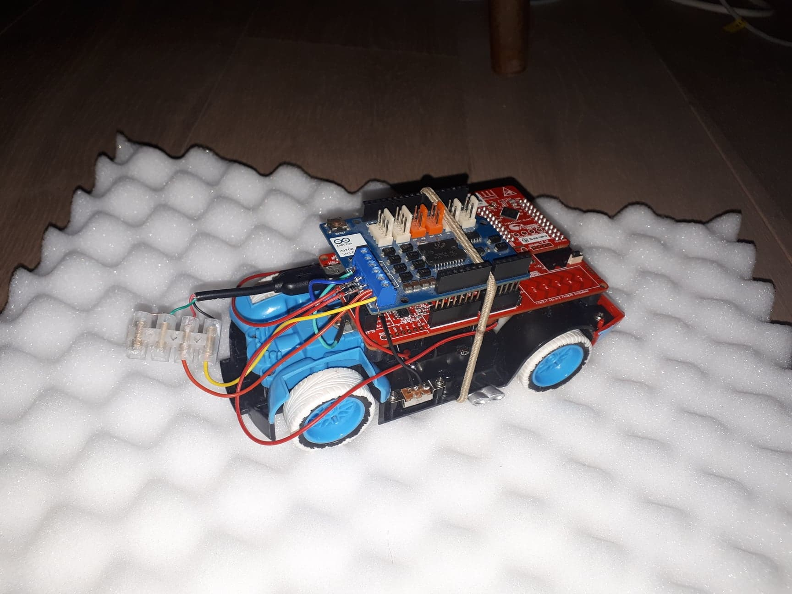

# DMX over SPI/ UART
*Written by Kasper Toetenel, Jens Vanhulst*

## Benodigdheden:
- CY8CKIT-042-BLE-A
- Arduino Motorshield REV3
- RC car
- PSoC Creator software
- MIT App Inventor

## Beschrijving

Het doel in ons project is om een RC-Auto om te bouwen naar een bluetooth gestuurde auto. Dit doen we door gebruik te maken van een PSoC 4 BLE-module en een Arduino Motorshield.
 
Om de besturing gebruiksvriendelijk te maken, hebben we ervoor gekozen om een APP te maken. Dit deden we met behulp van MIT App Inventor.

Als handige feature hebben we ook een bootloader geïmplementeerd zodanig dat men gemakkelijk software kan uploaden naar de BLE-Auto.

## Gebruik 

Als je de auto aanzet, zal deze in de bootloader komen wat gevisualiseerd wordt door een groen flikkerende LED. De bootloader zal vervolgens (als deze aanwezig is) de bootloadable application starten. 

Eens de applicatie gestart is, zal de blauwe LED flikkeren wat aangeeft dat het mogelijk is om een verbinding aan te gaan. Als je de App opent en op scan duwt, zal de Android App scannen naar

BLE-Apparaten in de buurt. Wanneer men vervolgens de BLE-CAR aanklikt en op connect duwt zal de app verbinding proberen te maken met de auto. Wanneer de verbinding slaagt zullen de richtingsknoppen tevoorschijn komen, zal de status veranderen naar ‘connected’ en zal de rode led op de auto oplichten. Wanneer de connectie faalt zal een foutmelding weergegeven worden.