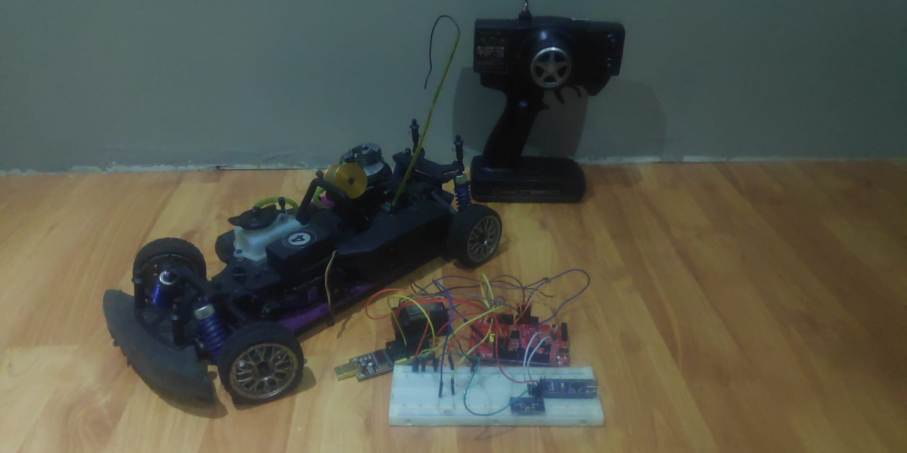

# RCcar with stability controller
*Written by Kazim Bozca and Oguzhan Erdem*

Deze paper bestudeert de werking van een elektronische stabilisatie systeem op een radio
gestuurde wagen. Een gyroscoop sensor wordt gebruikt om de rotatie van het voertuig te
meten. De doelstelling is om de auto automatisch bij te sturen als deze begint te slippen.



## Benodigdheden

- PSoC4
- MPU6500 6-axis gyroscoop module
- Jumper cables
- 27MHz AM Receiver & Transmitter

## I2C MPU6500 inlezen

De gyroscoop module wordt ingelezen door de I2C “Serial Communication Block”. Deze dient ingesteld te worden in “Master” mode. Na het initialiseren wordt er een aanvraag gedaan voor 14 bytes vanaf adres 0x3B tot en met 0x48. Met deze data worden alle assen ingelezen en ook de temperatuur op de chip.

Data register | description
------------- | ------------
0x3B | ACCEL_XOUT_H[15:8]
0x3C | ACCEL_XOUT_L[7:0]
0x3D | ACCEL_YOUT_H[15:8]
0x3E | ACCEL_YOUT_L[7:0]
0x3F | ACCEL_ZOUT_H[15:8]
0x40 | ACCEL_ZOUT_L[7:0]
0x41 | TEMP_OUT_H[15:8]
0x42 | TEMP_OUT_L[7:0]
0x43 | GYRO_XOUT_H[15:8]
0x44 | GYRO_XOUT_L[7:0]
0x45 | GYRO_YOUT_H[15:8]
0x46 | GYRO_YOUT_L[7:0]
0x47 | GYRO_ZOUT_H[15:8]
0x48 | GYRO_ZOUT_L[7:0]

Dit zijn 8 bit registers. De H-registers moeten met 8 plaatsen naar links verschoven en
opgeteld worden met de L-registers om een 16 bit waarde te krijgen.

## PWM duty cycle inlezen
Het PWM-signaal van de AM ontvanger wordt ingelezen zodat de RSCS weet of de gebruiker
aan het draaien is. Dit signaal wordt ingelezen met een Timer Counter UDB (Figuur 5) dat de tijd tussen een stijgende en dalende flank telt. Dit wordt gekoppeld met een interne klok van 12MHz voor een zeer hoge meetresolutie.

## Integratie gyroscoop en stuur
De ingelezen sensoren worden samengevoegd in een functie dat de stuurhoek zal veranderen naarmate de rotatie op de Z-as veranderd.

```c
int steeringAngle = turnRateSetPoint + (turnRateMeasured * steeringPos / 100);
```

De stuurhoek wordt met behulp van de PWM UDB (Figuur 7) naar buiten gestuurd. Na het inlezen van de periode in verschillende testen en gemiddelde waarden is geconcludeerd dat de periode gelijk is aan 20000 in de register. Dit signaal wordt opnieuw gebruikt om de aangepaste stuurhoek te moduleren en naar de uitgang te schrijven.

## PWM output

De stuurhoek wordt met behulp van de PWM UDB (Figuur 7) naar buiten gestuurd. Na het inlezen van de periode in verschillende testen en gemiddelde waarden is geconcludeerd dat de periode gelijk is aan 20000 in de register. Dit signaal wordt opnieuw gebruikt om de aangepaste stuurhoek te moduleren en naar de uitgang te schrijven.

## Discussie
De implementatie van dit project kan al snel zeer uitgebreid worden ook al is het een relatief simpel beginprogramma. Er zijn veel functies die gebruikt kunnen worden, zoals de snelheid van het voertuig uit de gyroscoop module halen en het signaal daarmee moduleren.

Daarnaast kan er voor gezorgd worden dat het systeem zelf kan bijleren. Het doel van dit project is om kort bij te sturen als de wagen slipt. Wat hier bij kan komen zijn onder andere verschillende modi zodat het voertuig stabiel is in rechte lijn, of automatisch een perfecte “drift” kan initiëren.
Verschillende bedrijven passen dit systeem al doe onder de naam “Electronic Stability Control”, echter is dit bij velen niet zo geavanceerd maar wel voorspelbaar in de zin van reactie.

## Conclusie
Door gebruik te maken van één gyroscoop is er een stabilisatie systeem ontwikkelt voor een RC-car. Echter zou meerdere sensoren meer accurate metingen met zich meebrengen, wat gunstiger is voor een stabilisatie systeem. Snelheid sensoren (bv. hall effect sensoren) op de wielen kunnen belangrijk informatie met zich meebrengen voor een stabilisatie systeem. Een stuurhoeksensor (bv. potentiometer) is evenals belangrijk omdat de positie van de stuur belangrijk is om de wagen bij te sturen als deze slipt.

Door gebruik van AI zou dit systeem het gedrag van de auto kunnen aanleren en zichzelf zodanig aanpassen voor een veiligere en geavanceerde werking.

Positie-en oriëntatie informatie over de wagen zijn onmisbaar voor een goed werkende stabilisatie systeem.

## Referenties

- Arashmarzi. (2015, Augustus 2). arashmarzi/speedometer. Retrieved from GitHub: https://github.com/arashmarzi/speedometer/blob/master/speedometer.ino
- kathc_1245071. (7, Januari 2019). How to read a PWM signal into a PSoC 4245. Retrieved from Cypress: https://community.cypress.com/thread/43198?start=0&tstart=0
- Language Reference. (n.d.). Retrieved from Arduino: https://www.arduino.cc/reference/en/
- TheDIYGuy999. (n.d.). TheDIYGuy999/Micro_RC_Receiver. Retrieved from GitHub: https://github.com/TheDIYGuy999/Micro_RC_Receiver
- woojay. (n.d.). Gyro Stabilizer W/ Arduino and Servo. Retrieved from Instructables circuits: https://www.instructables.com/id/Gyro-Stabilizer-W-Arduino-and-Servo/
- Zhan, W. (2016, December). A New Methodology for Reducing Yaw Rate Estimation Error. Retrieved from ResearchGate: https://www.researchgate.net/publication/311678645_A_New_Methodology_for_Reducing_Yaw_Rate_Estimation_Error